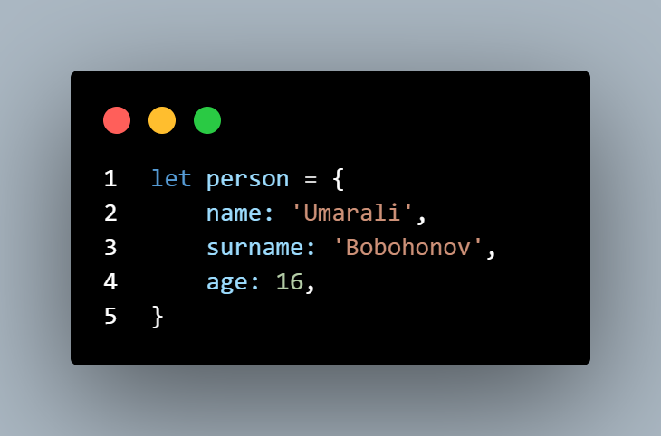
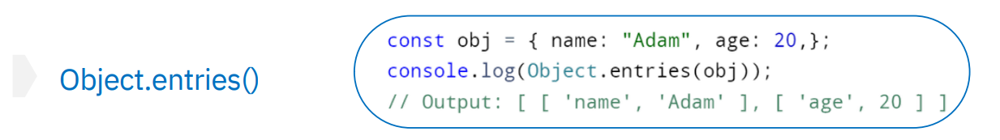
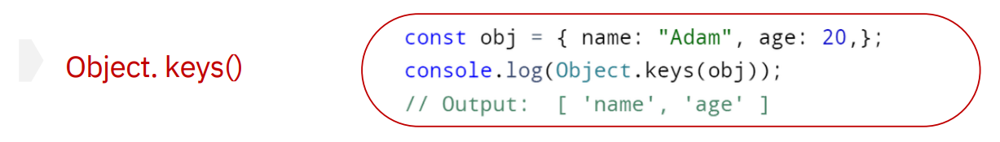
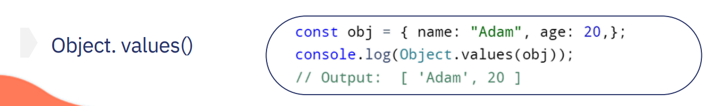

# Object
### Дар JavaScript, объект як объекти мустақил буда, дорои хосиятҳо ва намуд мебошад. Масъалан мошин, мошин, ба худ характеристикаҳо дорад: Марка, ранг вазн ва ғайраҳо. Ба ҳамин тариқ, объектҳои JavaScript метавонанд хосиятҳое дошта бошанд, ки хусусиятҳои онҳоро муайян мекунанд. Объект ба худ пропертиҳо дорад ки онҳо аз ключ ва значения иборат ҳастанд

### Тарзи аз объект элемент гирифтан:
``` js
let obj={
    name: 'John',
    age: 23,
}
console.log(obj.name);
```

# Methods
###  Объектҳо дар ҳама ҷо дар JavaScript истифода мешаванд, махсусан барои нигоҳ доштани маълумот.

### Дар объект keys(Ном) ва values(Кимат)- ро дар якчояги property меноманд.
### Объекти JavaScript типаш  object мебошад ва ба шумо имкон медиҳад, ки маҷмӯаҳои сершумори маълумотро нигоҳ доред. Калид номи усул аст ва арзиш метавонад ҳама гуна бошад, аз ҷумла объекти дигар бошад. Барои сохтани объект дар JavaScript, шумо метавонед қавсҳои фигурный истифода баред {}:
### Object хам ба худ методхо дорад. Он аз се метод иборат аст.
### Методи аввал методи object.enteries() мебошад, ки он барои хамаи object - ро бо property - ашро массив мекунад.

### Методи дуюм методи object.keys() мебошад, ки он хамаи keys(Номи калид)-ро ба массив табдил медихад.

### Методи сеюм методи object.values() мебошад, ки он барои хамаи values(киматхо)-ро ба массив табдил додан лозим аст.


# Destructuring - Ин як механизме ҳаст ки барои значенияҳои объектро ба вериэйблҳо баровардан мебошад. Барои ин кор бояд номҳои вериэйбл ба ключҳои пропертии объект баробар бошанд
# spread дар объект ин механизме мебошад барои пропертиҳои объектро ба объекти дигар бахшидан лозим аст.

